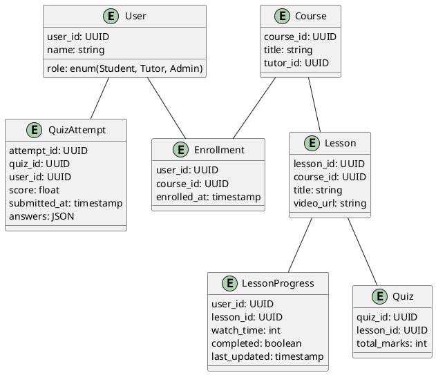

# 📈 High-Level Design: Scalable Live Class & Content Delivery Platform

## 🌟 Objective

Design a scalable and reliable architecture for a modern EdTech platform that supports real-time live classes, on-demand content, and real-time user progress tracking, built with a monorepo (Turborepo) using Node.js, Next.js, PostgreSQL, Redis, Azure Tables, and WebSockets.

---

## 📆 Key Requirements Recap

| Feature            | Details                                                                |
| ------------------ | ---------------------------------------------------------------------- |
| Live Classes       | Real-time video, chat, screen sharing, polls (1,000+ concurrent users) |
| On-Demand Content  | Efficient streaming of pre-recorded lessons & learning materials       |
| User Portfolios    | Personalized, real-time progress and course data                       |
| Real-Time Updates  | Quiz scores, video progress instantly reflected                        |
| Monorepo Structure | Turborepo-managed apps: Student, Admin, Tutor                          |
| Tech Stack         | Node.js, Next.js, PostgreSQL, Azure Tables, Redis, WebSockets          |

---

## 🕊️ High-Level Architecture Diagram (Text Version)

```
                      +----------------------+        +------------------+
                      |    External Users    |<-----> |   CDN (Video)    |
                      +----------+-----------+        +--------+---------+
                                 |                             |
                                 v                             v
        +------------------------+-------------------------------+
        |                Next.js Frontends (SSR, ISR)            |
        |     Student / Tutor / Admin Apps via Turborepo        |
        +------------+------------------+------------------------+
                     |                  |
                     v                  v
           +---------+--+        +------+-----------+
           |  API Gateway |       | WebSocket Server |
           | (Node.js)    |       |   (Socket.IO)     |
           +---------+--+        +--------+----------+
                     |                     |
     +---------------+--+        +--------+----------+
     | Application Server |       |  Redis Pub/Sub    |
     | (Node.js + BFF)   |       |  (Session/Chat)    |
     +--------+----------+       +--------------------+
              | \
              |  \_____________________________________
              |                                        |
        +-----+-----+                            +-----+------+
        | PostgreSQL |                            | Azure Tables |
        | (Relational|                            | (Logging,    |
        |  Data)     |                            |  Audit)      |
        +-----------+                            +-------------+
```

---

## 📒 Component Overview

### 1. **Next.js Frontends (Turborepo)**

- **Apps**: `student-app`, `tutor-app`, `admin-app`
- Shared components/utilities live in `packages/`
- SSR/ISR for course pages, dashboards

### 2. **API Gateway (Node.js)**

- Central entrypoint for REST APIs, auth
- Middleware for rate limiting, validation, token checks

### 3. **WebSocket Server (Socket.IO)**

- Handles real-time chat, class participation, poll results
- Redis-backed for multi-node scalability

### 4. **Application Server (BFF Layer)**

- Coordinates business logic
- Talks to PostgreSQL, Redis, Azure Tables

### 5. **PostgreSQL**

- Stores user data, course progress, quiz scores, enrollments
- Relationships and analytics

### 6. **Azure Tables**

- Logs, audit trails (e.g., video watch logs, class joins)
- Inexpensive and horizontally scalable

### 7. **Redis**

- Caching portfolio data for real-time reads
- WebSocket session state
- Leaderboards / poll data

### 8. **CDN for Video (e.g., Azure Blob Storage + Azure CDN)**

- Pre-recorded video content stored and streamed at scale

---

## 📊 ER Diagram (Simplified)



---

## 💪 Tech Stack Utilization

| Technology                 | Usage                                                  |
| -------------------------- | ------------------------------------------------------ |
| **Node.js**                | API Gateway, BFF, Socket.IO servers                    |
| **Next.js**                | Frontends (Turborepo) - student/tutor/admin apps       |
| **PostgreSQL**             | Relational data - progress, enrollments, quiz results  |
| **Azure Tables**           | Logging, audits, watch time, class joins               |
| **Redis**                  | Cache portfolios, WebSocket sessions, poll & chat data |
| **WebSockets (Socket.IO)** | Live classes, chats, real-time interactions            |

---

## 🛡️ Scalability & Reliability

### Scalability

- **Horizontal scaling**: WebSocket and API nodes scaled via load balancer
- **CDN usage**: Offloads video traffic
- **Redis**: Reduces database pressure for real-time reads
- **Azure Tables**: Schema-less, ideal for scaling logs and actions

### Reliability

- **PostgreSQL replication** for failover
- **Redis cluster** to ensure uptime
- **Circuit breakers** on external API calls
- **Monitoring with Azure Monitor + custom alerts**

---

## 📝 Monorepo (Turborepo) Benefits

| Benefit               | Explanation                                                     |
| --------------------- | --------------------------------------------------------------- |
| Shared components     | Reuse UI libraries, types, utilities across student/tutor/admin |
| Simplified deployment | Atomic versioning and deployment pipelines                      |
| Cross-app consistency | Centralize validation logic, BFF interactions                   |
| Faster dev onboarding | Single repo to understand and contribute to                     |

---

## 🚀 Future Enhancements

- Integrate Kafka for event streaming (lesson watched, quiz submitted)
- Use TimeScaleDB for time-series analytics
- AI layer to personalize learning based on tracked progress

---

## 📄 Conclusion

This high-level design supports our goal of creating a robust, scalable EdTech platform capable of real-time interactivity and efficient content delivery for thousands of users using modern web architecture best practices.
